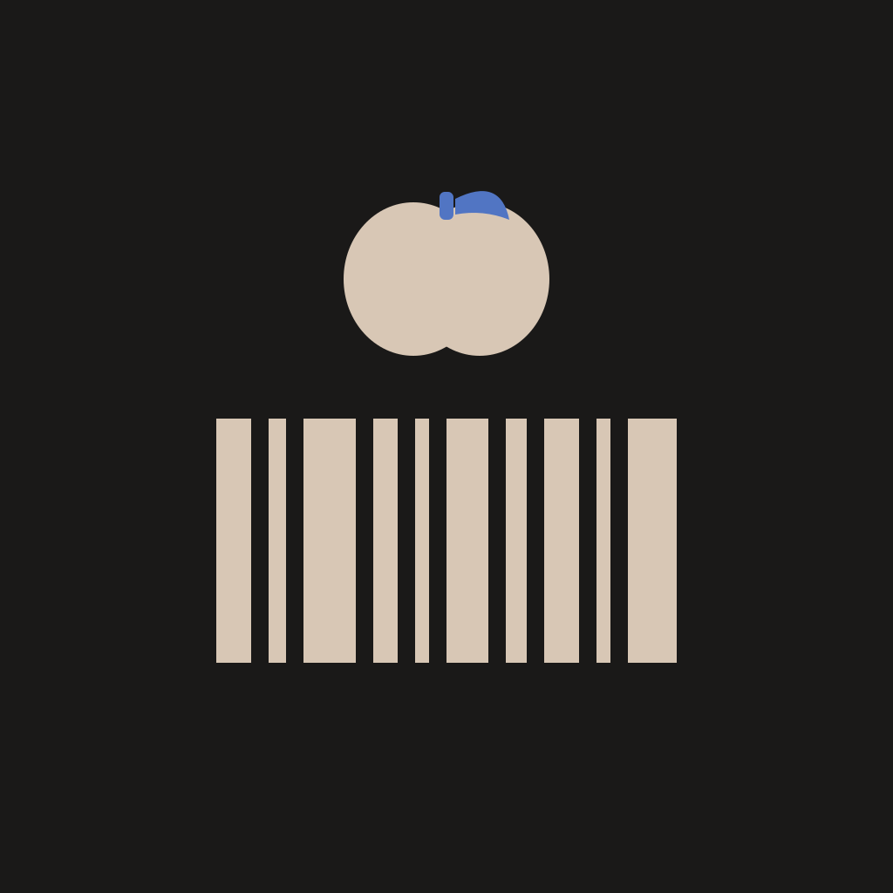

<p align="center">
  
</p>

<h1 align="center">Balori</h1>

<p align="center">
  <strong>A mobile app built with Expo, React Native, and Material Design 3.</strong>
</p>

<p align="center">
  <a href="https://github.com/PianoNic/Balori/stargazers"></a>
  <a href="https://github.com/PianoNic/Balori/releases"></a>
</p>

## Tech stack

Expo SDK 54 • React Native 0.81 • React Native Paper • TypeScript • Expo Router • Epilogue font

## Setup

```bash
bun install
bun run start
```

Also works with `npm install` / `npm run start`.

For Expo Go on a physical device, use `--tunnel` if not on the same network.

## Contributing

Before opening an issue or PR, please read [`CLAUDE.md`](CLAUDE.md).

## License

[MIT](LICENSE)
